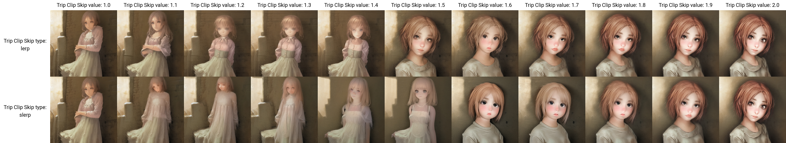

# Trip Clip Skip - CLIP stop (aka 'clip skip') interpolation extention for Web UI

## What's this?

This is an extension for [stable-diffusion-webui](https://github.com/AUTOMATIC1111/stable-diffusion-webui) that adds a custom script, which let you to interpolate `CLIP_stop_at_last_layers` (aka `clip skip`).

## Examples

```
Sampling method: DPM++ 2M Karras
Sampling steps: 15
Size: 512x512
CFG Scale: 7.0
Seed: 4137231132
Prompt: a girl
Clip skip: [1,2] (step=0.1)
```


